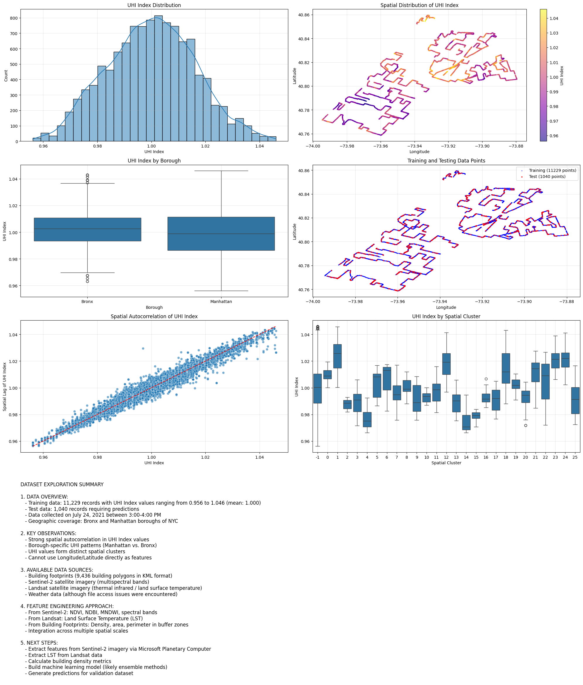
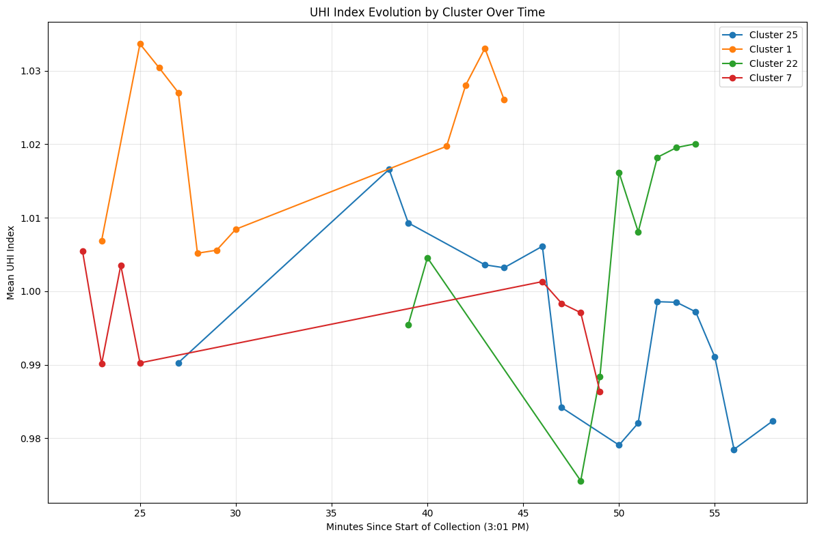
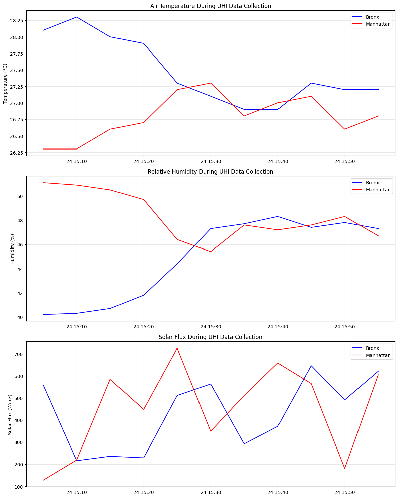
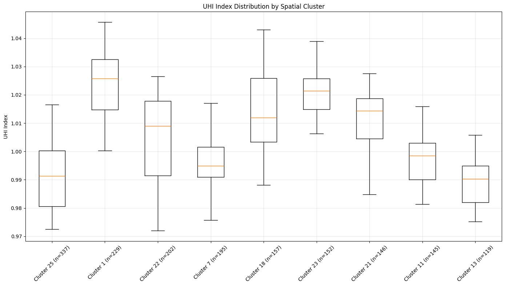
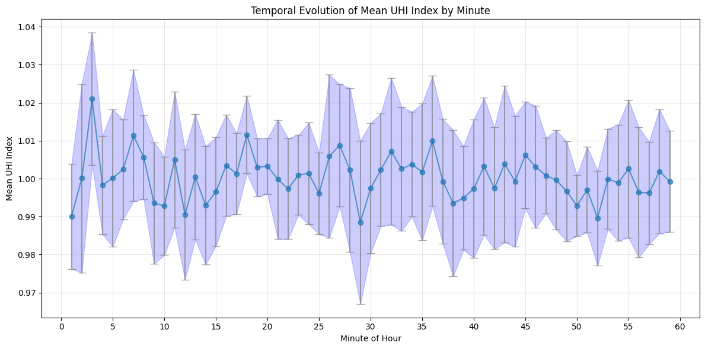
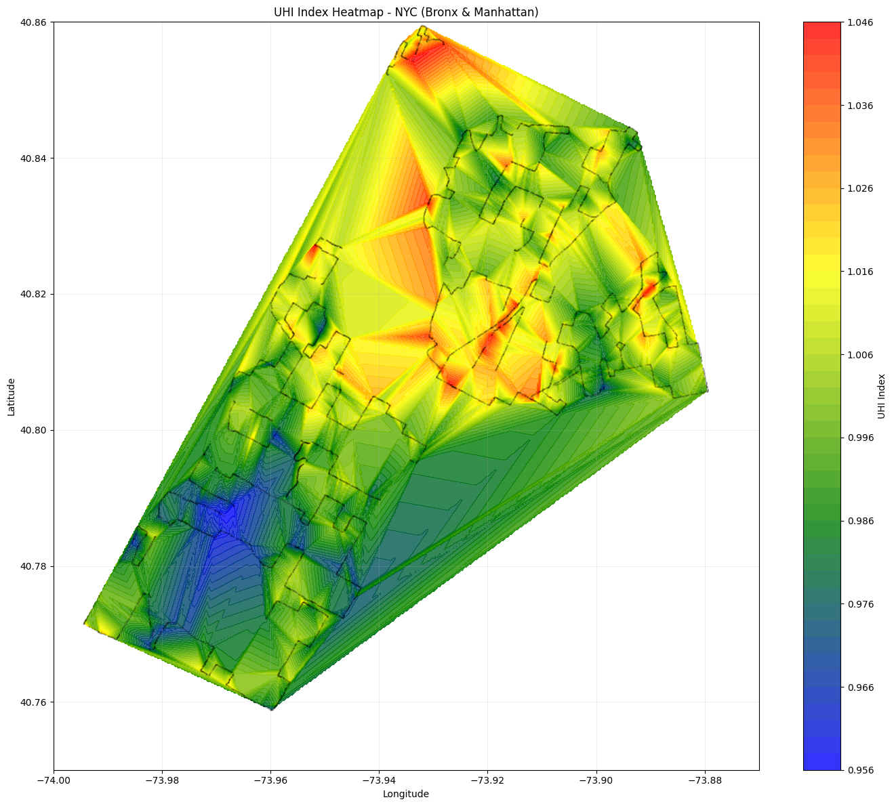
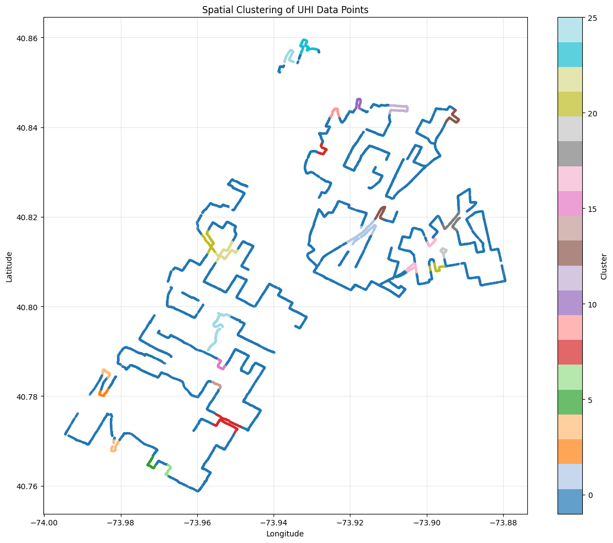
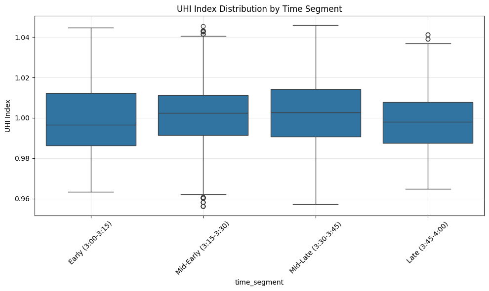
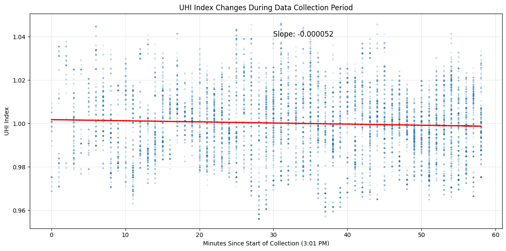
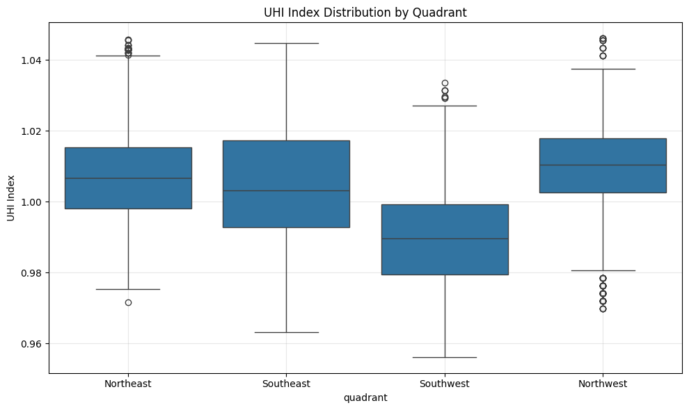

# The 2025 EY Open Science AI and Data Challenge: Cooling Urban Heat Islands

**Note:** This repository is a documentation for all experiments throughout EY Open Science competition.
--

--
## Datasets
### - Original Data 
- [Weather Dataset](datasets/NY_Mesonet_Weather.xlsx)
- [UHI Dataset](datasets/Training_data_uhi_index.csv)
- [Landsat Data](notebooks/Landsat_LST.ipynb)
- [Sentinel2_GeoTIFF Data](notebooks/Sentinel2_GeoTIFF.ipynb)
- [Building_Footprint Data](datasets/Building_Footprint.kml)
### - Imputed Data
- [Dataset](datasets/uhi_imputed.csv)
  
## External Notebooks
- [Multilayer Perceptron](https://www.kaggle.com/code/cchangyyy/uhi-mlp)
- [Transformers](https://www.kaggle.com/code/cchangyyy/uhi-transformer)

## Visualization
You can find all visualizations [here](images/)
- **Distribution**  
    
  **Observation:** Shows the spread of data points across the study area.  
  **Insight:** Indicates heterogeneous urban characteristics and variability in key parameters.

- **Evolution of Clusters**  
    
  **Observation:** Illustrates how clusters evolve over time.  
  **Insight:** Trends in clustering may reflect shifts in urban heat patterns.

- **Air Temperature**  
    
  **Observation:** Highlights variations in air temperature across different regions.  
  **Insight:** Higher temperatures in certain areas could be linked to dense infrastructure or low vegetation cover.

- **Distribution of Clusters**  
    
  **Observation:** Depicts groupings of data points into clusters.  
  **Insight:** Cluster formations help identify regions that may benefit from targeted heat mitigation strategies.

- **Mean UHI**  
    
  **Observation:** Displays average urban heat island (UHI) effects across the area.  
  **Insight:** Regions with elevated mean UHI values are prime candidates for cooling interventions.

- **UHI Heatmap**  
    
  **Observation:** A heatmap that visually represents the intensity of UHI effects.  
  **Insight:** Identified hotspots can guide urban planning and resource allocation to reduce heat exposure.

- **Spatial Clusters**  
    
  **Observation:** Maps out spatial clusters showing regions with similar heat profiles.  
  **Insight:** Understanding these clusters aids in effectively targeting cooling measures.

- **Time Segments**  
    
  **Observation:** Breaks down the data into time segments to reveal temporal variations.  
  **Insight:** Temporal patterns can inform the scheduling of interventions during peak heat periods.

- **UHI Change**  
    
  **Observation:** Shows the changes in UHI intensity over the study period.  
  **Insight:** Monitoring UHI change is essential for long-term climate resilience planning.

- **UHI Quadrants**  
    
  **Observation:** Divides the study area into quadrants based on UHI intensity levels.  
  **Insight:** This segmentation helps in pinpointing extreme heat areas for focused cooling strategies.
  
## Submissions
1. Ensemble Method (R2: 0.8002)
2. Multilayer Perceptron (R2: 0.6947)
3. Transformers (R2: 0.6139)
  
## Suggested Improvements
- Putting more efforts into Feature Engineering
- Experiments with different Model Architectures
- Research on different Data Preprossing method

